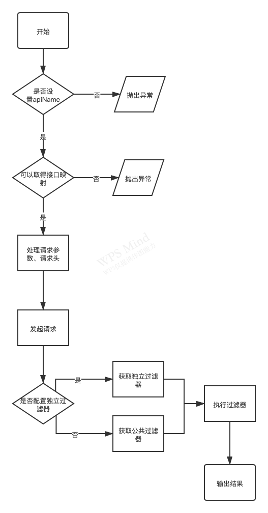

# 接口配置
在 《应用结构 > 应用主体》中我们提到过：

> 在初始化时，会尝试在根目录的 configs 文件夹中加载一个名为 main.js 的文件作为框架的配置并传递给应用主体

在这个 main.js 文件中，可以通过字段 api 对请求接口进行配置，可以配置的内容有以下几个：

- 接口驱动 (driver)：传入一个用于调用接口的驱动，默认使用 axios ，如果你希望使用其它的（比如jquery.ajax）或者你自己想实现一个，只要在这里传入一个根据要求编写的的驱动文件即可。
- 过滤器 (filter)：我们会将请求接口获取到的原始响应数据通过回调函数的形式返回到过滤器中，拿到原始数据后，我们可以根据接口的返回值（比如状态码）进行分类，分类后，我们就可以使用 getIsSuccess 方法来判断此次接口请求是否成功了
- 接口地址映射 (list)：在实际的开发中，我们不会去使用硬编码的方式直接指定一个接口地址来访问，而是通过地址映射将接口地址映射成一个字符串进行访问，这样当我们需要更换接口协议、域名甚至是整个接口地址时，我们只需要修改配置文件，而不是找到具体调用接口的代码进行需改。
- 默认请求头 (defaultHeaders)：获取请求中需要默认携带的请求头

## 接口驱动
用来配置最终实现接口调用的驱动，比如VUE是不带接口请求的，一般我们会独立安装axios或者jquery.ajax来实现接口请求，而微信小程序是使用wx.request进行接口访问的。
只要根据要求编写接口驱动，我们就可以无视各类开发框架带来的差异，实现零成本过度。
VF默认提供了 axios 和 wx 两个驱动文件，它们存放在框架代码的 configs.apis 目录中（注意，不是项目根目录的configs文件夹），你可以根据自己的需要进行配置。

## 过滤器
我曾经很苦恼，我们没办法要求后端的接口采用一致的返回格式，一致的数据结构和规范，而作为一名全栈开发，我也和苦恼调用第三方接口时面对五花八门的返回结构，每次都得去适应别人的编程习惯。

于是我们想到，为什么我们不使用一个前置过滤器，将通过接口取到的数据格式化成我们想要的格式呢，没错，过滤器就是做这件事的。

VF的接口请求都是通过 Api 类实现的，Api类在调用接口取得原始的响应数据后，会调用接口对应的过滤器，而后者是存粹由开发者自定义编写的脚本，在这里允许开发者根据响应数据解析响应类型，以及根据响应数据进行的数据提取。

### 解析响应类型
有了原始的响应数据，我们可以根据请求状态码是否等于200来确认请求是否成功，再根据业务状态码或者其它字段判断业务逻辑是否执行成功来对该响应的结果进行分类，Api 类默认提供了以下三个分类并且我们推荐是使用它们：
- Api.SUCCESS_TYPE：成功
- Api.FAIL_TYPE：失败
- Api.ERROR_TYPE：错误

我们建议，除非是这三个分类无法满足你的需求，否则不要轻易的创建一个新的分类（尽管框架允许你这么做），过多的分类会大大的增加理解上的负担。

只有当接口解析器命中一个分类为 Api.SUCCESS_TYPE 的解析器时，getIsSuccess 方法才会返回 true，否则将返回 false。当命中一个解析器时，VF会调用该解析器的数据提取方法。

### 数据提取
和解析响应类型类似，我们一样会将原始的响应数据传递给数据提取的方法，要求该方法返回一个无状态对象，并且该对象里的内容最终可以通过 response.字段名 的方式获取。

## 接口地址映射
通过一个对象属性将接口地址映射成字符串的形式，让我们可以避免接口地址硬编码的方式来调用接口。该字段的值支持多层嵌套，在使用的时候通过英文逗号 "." 作为引用下级项，比如我们配置了以下映射：
```json
{
    "user": {
        "list": {
            "url": "https://www.demo.com/users"
        },
        "auth": {
            "login": {
                "url": "https://www.demo.com/user/login"
            }
        }
    }
}
```
我们在需要使用用户列表时，可以使用字符串 user.list 进行引用，当我们需要使用登录接口时，可以使用字符串 user.auth.login 进行引用，现在调用接口变成下面的形式：
```javascript
let response = await Api.getInstance()
    .setApiName('user.list') // or user.auth.login
    .get()
```
在通过 apiName 取得对应的接口映射后，get方法会使用对应的 url 字段值作为接口地址进行调用，调用后即可取得原始的响应数据(originResponse)，接着程序会尝试在接口映射中取字段为 filter 的值作为过滤器，如果指定的接口映射中没有对应的过滤器则是使用全局配置中的 api.filter 作为过滤器。

一个Get请求或者Post请求完整的流程如下：



# 配置表
| 名称    | 字段名               | 必须 | 类型       | 说明                                                                     |
|-------|-------------------|----|----------|------------------------------------------------------------------------|
| 驱动    | driver            | 否  | class    | 指定需要使用的接口驱动                                                            |
| 默认请求头 | defaultHeaders    | 否  | function | 请求发起前，会调用这个方法，并将起返回值合并到已有的请求头中，使用该方法可以设置全局请求头                          |
| 公共过滤器 | filter            | 是  | array    | 如果指定接口没有配置过滤器则自动使用公共过滤器，该字段是一个数组，可配置多个过滤器，但最多只会命中一个                    |
| 过滤类型  | filter[].type     | 是  | string   | 过滤器命中后所分类的类型，推荐使用 Api.SUCCESS_TYPE、Api.FAIL_TYPE 或 Api.ERROR_TYPE 中的一个 |
| 过滤校验  | filter[].validate | 是  | function | 发起请求后，会将获得的原始响应数据传入该方法，若方法返回 true 则视为命中该过滤器                            |
| 数据提取  | filter[].data     | 是  | function | 命中过滤器后，会将获得的原始响应数据传入该方法，要求该方法返回一个object值，这些值最终可以在 ApiResponse 中获取      |
| 接口列表  | list              | 是  | object   | 需要用到的接口地址都要在这里进行映射才可使用                                                 |
| 接口地址  | list.*.url        | 是  | string   | 需要调用的接口地址，其中 * 代表任意级数的引用                                               |
| 专用过滤器 | list.*.filter     | 否  | object   | 和公共过滤器格式一致，当配置了该字段后优先使用它                                               |

